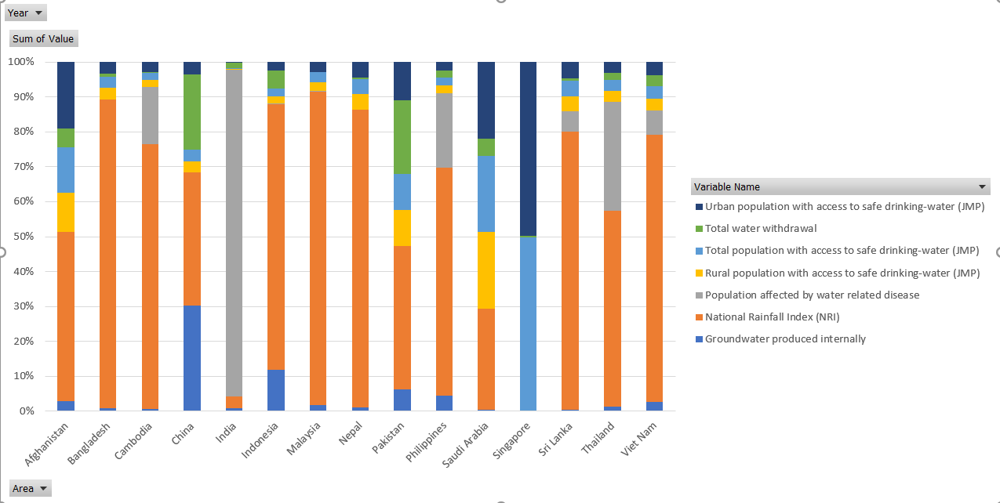
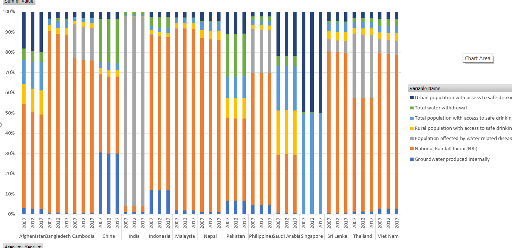

# Call for Code solution starter kit: Clean Water and Sanitation

  

The need for clean water is not only limited to humans but also extends to all living things as a naturally occurring component for life continuity on planet Earth. Water quality monitoring is important for guiding safety management and ensuring public health. With a global estimate of 7 billion dreams, many of whom still lack access to quality drinking water, it’s important to share knowledge and information all around the world to break the vicious cycle of ignorance and water wastage. With expatriate estimates of water project costs, this shall reduce failure of building water safety capacity.

## Contents

1. [Short description](#short-description)
1. [Video](#video)
1. [The architecture](#the-architecture)
1. [Getting started](#getting-started)
1. [Aquastat data analysis](#aquastat-data-analysis)
1. [Contributing](#contributing)
1. [Acknowledgments](#acknowledgments) 

## Short description

This starter kit can help you begin your Call for Code solution. The starter kit pulls together resources to help you and your team use technology to create applications to tackle clean water and sanitation issues around the world.

URL to app:
https://arcgis-based-watermaps.eu-gb.mybluemix.net/

### What's the problem?

According to the [World Health Organization](https://www.who.int/news/item/18-06-2019-1-in-3-people-globally-do-not-have-access-to-safe-drinking-water-unicef-who), 2.2 billion people around the world do not have safely managed drinking water services, 4.2 billion people do not have safely managed sanitation services, and 3 billion people lack basic handwashing facilities. These services are critical in preventing the spread of COVID-19 and other diseases. Even in areas that have these services, there are vast inequalities in the accessibility, availability, and quality of the services. 

UNICEF is urgently appealing for funding and support to reach more children with basic water, sanitation, and hygiene facilities, especially those children who are cut off from safe water because they live in remote areas, in places where water is untreated or polluted, or because they are without a home, living in a slum or on the street.

Link to ArcGIC Web App Builder Application:
https://ru2mdlzvzu4sknf3.maps.arcgis.com/apps/webapapviewer/index.html?id=22332ef7258e48a188e7486471c4ab9d#

Link to IBM Cloud hosted app:
https://arcgis-based-watermaps.eu-gb.mybluemix.net/#

### The idea

To encourage optimal water choices by consumers and local governments and to incentivize water sustainability, we propose devising and implementing an API for water data collection and dissemination. 

A community leader can find verified clean sources of water near to them in one place in near real time 
and track/compare water sanitation results against historical trends and nearby communities to drive a ~50% reduction in water illness-related hospitalizations
and can assess their water usage and make more informed decisions to prioritize most essential needs & decrease water waste. With IoT integration, water quality monitoring information is also gathered which is analysed over the changing climatic conditions around the year using Watson AI tools to help in decisions too.

Essential technologies needed:

- Water analysis technology (IoT)
- GPS location data for water sources relative to user location
- Maps of surface water, aquifers, rainfall, and watersheds relating to user location
- Historic data on local rainfall
- Historic comparison of color of surface water over time from satellite imagery
- Rainfall forecast
- Lab test results of water quality upstream and downstream
- Water flow rate sensors to monitor household irrigation
- Track and trace
- Publicity of results and water source to report mapping
- Pollution source remediation and containment

## Video

## The architecture

1. The user or community leader accesses a Clean Water Insights Dashboard.
1. The insights dashboard requests the Clean Water API for data that the user wants (including queries made on a chatbot).
1. The user can converse with a chatbot to get necessary information, and the insights dashboard can act as an orchestration application for the chatbot.
1. The Clean Water API component retrieves the required data from various sources and aggregates them as necessary.
1. A machine learning module uses the data sources as a corpus to build a recommendation model and hosts that model.
1. The Clean Water Water Insights Dashboard can get recommendation and prediction information from a recommendation engine.

## Getting started

You can create a solution based on the proposed solution architecture by exploring the following resources on [IBM Developer](https://developer.ibm.com/).

## Aquastat data analysis
Stacked column pivot chart for the data provided by the aquastat is as below. 

## Contributing

Please read about [contributing](CONTRIBUTING.md) to this repository for details on our code of conduct and the process for submitting pull requests.

## Contributors

Aaron Masuba
Tejaswini J.
Rushi Shah

## License

This starter kit is licensed under the Apache 2 License - see the [LICENSE](LICENSE) file for details

- [Charity Water](https://www.charitywater.org/global-water-crisis)
- [Nature Conservancy](https://www.nature.org/en-us/what-we-do/our-priorities/provide-food-and-water-sustainably/)
